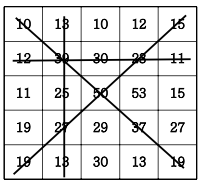
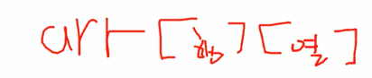

## 격자판 최대합
- 5*5 격자판에 아래롸 같이 숫자가 적혀있습니다.
- N*N의 격자판이 주어지면 각 행의 합, 각 열의 합, 두 대각선의 합 중 가 장 큰 합을 출력합 니다.


### 기준 행 열


##  입력예제 1
```
10 13 10 12 15
12 39 30 23 11
11 25 50 53 15 
19 27 29 37 27
19 13 30 13 19
```

##  출력예제 1 
- 155

## 내가 푼 방법
```
function solution(arr) {
  let answer = Number.MIN_SAFE_INTEGER
  let n = arr.length

  let row = []
  let column = []
  
   let rowMax = 0
   let columnMax = 0
   let normalSum = 0
   let reverseSum = 0
   
   // row
   for(let i=0; i<n; i++){
     let rowSum = arr[i].reduce((a,b) => a+b,0)
      
     row.push(rowSum)
   }
   rowMax = Math.max(...row)

   // column
   for(let i=0; i<n; i++) {
      let columnSum = 0
      for(let j=0;j<n;j++){
         columnSum += arr[j][i]
         column.push(columnSum)
      }
   }
   columnMax = Math.max(...column)


   // diagonal
   for(let i = 0; i<n; i++){
       normalSum += arr[i][i];
      reverseSum += arr[i][n-i-1]
   }

answer = Math.max(rowMax, columnMax,normalSum,reverseSum)

   return answer
}

let arr=[[10, 13, 10, 12, 15], 
        [12, 39, 30, 23, 11],
        [11, 25, 50, 53, 15],
        [19, 27, 29, 37, 27],
        [19, 13, 30, 13, 19]];

solution(arr)
```

## 강사님이 푼 방법
```
          function solution(arr){  
                let answer=Number.MIN_SAFE_INTEGER;
                let n=arr.length;
                let sum1=sum2=0;
                for(let i=0; i<n; i++){
                    sum1=sum2=0;
                    for(let j=0; j<n; j++){
                        sum1+=arr[i][j];
                        sum2+=arr[j][i];
                    }
                    answer=Math.max(answer, sum1, sum2);
                }
                sum1=sum2=0;
                for(let i=0; i<n; i++){
                    sum1+=arr[i][i];
                    sum2+=arr[i][n-i-1];
                }  
                answer=Math.max(answer, sum1, sum2); 
                return answer;
            }

            let arr=[[10, 13, 10, 12, 15], 
                     [12, 39, 30, 23, 11],
                     [11, 25, 50, 53, 15],
                     [19, 27, 29, 37, 27],
                     [19, 13, 30, 13, 19]];
            console.log(solution(arr));
```